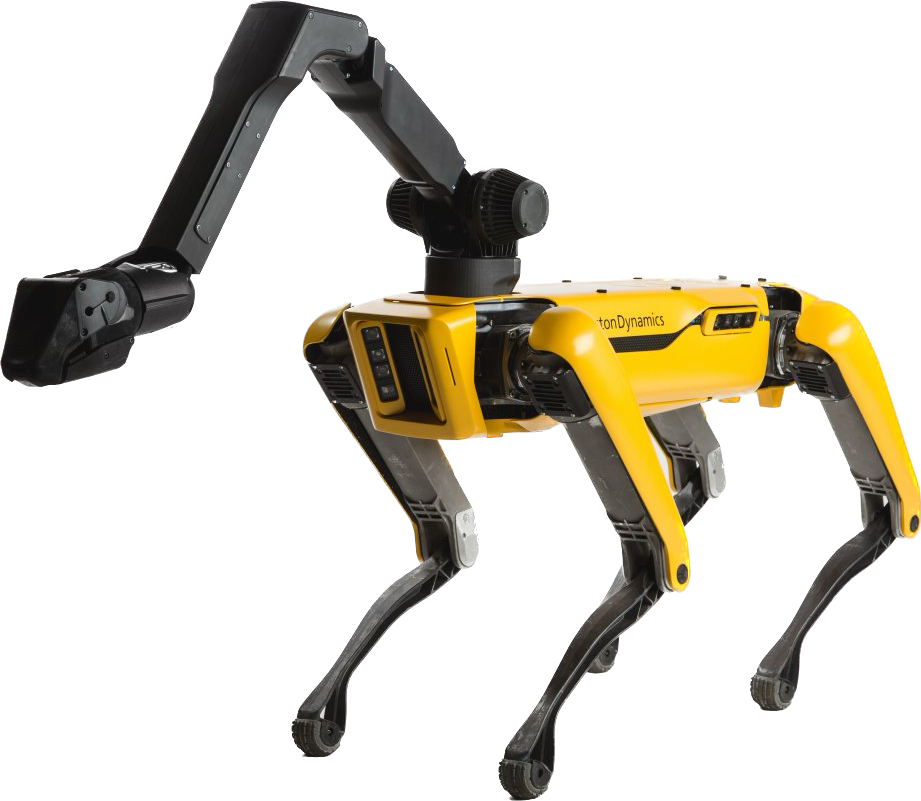

<p align="center">
  
  <h1 align="center">Spot ROS 2</h1>
  <p align="center">
    
    <a href="https://github.com/astral-sh/ruff">
      
    </a>
    <a href="https://github.com/psf/black">
      
    </a>
    <a href="https://github.com/bdaiinstitute/spot_ros2/actions/workflows/ci.yml">
      
    </a>
    <a href="https://coveralls.io/github/bdaiinstitute/spot_ros2?branch=main">
      
    </a>
    <a href="LICENSE">
      
    </a>
  </p>
</p>

# Overview
`spot_ros2` is a set of ROS 2 packages for interacting with Boston Dynamics' Spot, based off the [the ROS 1 equivalent](https://github.com/heuristicus/spot_ros).
Its [`spot_driver`](spot_driver) package is designed to bridge the core functionality of the Spot SDK to ROS 2, and exposes topics, services, and actions necessary to control Spot and receive state information (such as images). 
Currently, this repository corresponds to version 4.1.1 of the [spot-sdk](https://github.com/boston-dynamics/spot-sdk/releases/tag/v4.1.1).

## Requirements
This repository is supported for use with Ubuntu 22.04 and [ROS 2 Humble](https://docs.ros.org/en/humble/index.html) on both ARM64 and AMD64 platforms.

## Installation
Set up your ROS 2 workspace, and clone the repository in the `src` directory:
```bash
mkdir -p <ROS workspace>/src && cd <ROS workspace>/src
git clone https://github.com/bdaiinstitute/spot_ros2.git
```
Then, initialize and install the submodules.
```bash
cd spot_ros2
git submodule init
git submodule update
```

Next, run the following script to install the necessary Boston Dynamics packages (both Python and C++) and ROS dependencies.
The install script takes the optional argument ```--arm64```; it otherwise defaults to an AMD64 install.
```bash
./install_spot_ros2.sh
or
./install_spot_ros2.sh --arm64
```
From here, build and source your ROS 2 workspace.
```bash
cd <ROS workspace>
colcon build --symlink-install
source install/setup.bash
```

### Alternative - Docker Image

Alternatively, a Dockerfile is available that prepares a ready-to-run ROS2 Humble install with the Spot driver installed.
The Docker image can be built and minimally run with the following commands:
```bash
cd <ROS workspace>/src/spot_ros2
docker build . -t spot_ros2
docker run -it spot_ros2:latest
```

The following flags may be useful for extra functionality when running the image.
| Flag     | Use             |
| -------- | --------------- |
| `--runtime nvidia` + `--gpus all`  | Use the [NVIDIA Container Runtime](https://developer.nvidia.com/container-runtime) to run the container with GPU acceleration |
| `-e DISPLAY`  | Bind your display to the container in order to run GUI apps. Note that you will need to allow the Docker container to connect to your X11 server, which can be done in a number of ways ranging from disabling X11 authentication entirely, or by allowing the Docker daemon specifically to access your display server.  |
| `--network host` | Use the host network directly. May help resolve issues connecting to Spot Wifi |


# Packages

This repository consists of a series of ROS 2 packages for usage with Spot.
Further documentation on how each of these packages can be used can be found in their resepective READMEs.

* [`spot_driver`](spot_driver): Core driver for operating Spot. This contains all of the necessary topics, services, and actions for controlling Spot and receiving state information over ROS 2.
  * The driver can be launched via the following command after building and sourcing your workspace. More details can be found on the [`spot_driver` README](spot_driver/README.md).
    ```
    ros2 launch spot_driver spot_driver.launch.py [config_file:=<path/to/config.yaml>] [spot_name:=<Spot Name>] [launch_rviz:=<True|False>] [launch_image_publishers:=<True|False>] [publish_point_clouds:=<True|False>] [uncompress_images:=<True|False>] [publish_compressed_images:=<True|False>] [stitch_front_images:=<True|False>]
    ```
* [`spot_examples`](spot_examples): Examples of how to control Spot via the Spot driver.
* [`spot_msgs`](spot_msgs): Custom messages, services, and interfaces relevant for operating Spot.

The following packages are used to enable joint level control of Spot via ROS 2 control.
* [`spot_ros2_control`](spot_ros2_control): Contains core launchfiles for bringing up Spot's ROS 2 control stack, and some examples of how to use this.
* [`spot_hardware_interface`](spot_hardware_interface): Creates a ROS 2 control hardware interface plugin for operating Spot with the joint level API.
* [`spot_controllers`](spot_controllers): Holds some simple forwarding controller plugins useful for sending commands.

This package also pulls in the following packages as submodules:
* [`ros_utilities`](https://github.com/bdaiinstitute/ros_utilities): The AI Institute's convenience wrappers around ROS 2.
* [`spot_wrapper`](https://github.com/bdaiinstitute/spot_wrapper): A Python wrapper around the Spot SDK, shared as a common entry point with Spot's ROS 1 repo.
* [`spot_description`](https://github.com/bdaiinstitute/spot_description): contains the URDF of Spot and some simple launchfiles for visualization.

This repository also depends on the `bosdyn_msgs` ROS package.
This package contains ROS versions of [Boston Dynamics' protobufs](https://dev.bostondynamics.com/protos/bosdyn/api/proto_reference) that are used with the Spot SDK.
As it is very large, this is installed as a debian package as part of `install_spot_ros2.sh`.
It can be installed from source as a normal ROS package [here](https://github.com/bdaiinstitute/bosdyn_msgs) if desired instead.


# Help

If you encounter problems when using this repository, feel free to ask a question in the [discussions](https://github.com/bdaiinstitute/spot_ros2/discussions), or open an [issue](https://github.com/bdaiinstitute/spot_ros2/issues) describing the problem in context.

## Verify Package Versions
If you encounter `ModuleNotFoundErrors` with `bosdyn` packages upon running the driver, it is likely that the necessary Boston Dynamics API packages did not get installed with `install_spot_ros2.sh`. To check this, you can run the following command. Note that all versions should be `4.1.1`.
```bash
$ pip list | grep bosdyn
bosdyn-api                               4.1.1
bosdyn-api-msgs                          4.1.1
bosdyn-auto-return-api-msgs              4.1.1
bosdyn-autowalk-api-msgs                 4.1.1
bosdyn-choreography-client               4.1.1
bosdyn-client                            4.1.1
bosdyn-core                              4.1.1
bosdyn-graph-nav-api-msgs                4.1.1
bosdyn-keepalive-api-msgs                4.1.1
bosdyn-log-status-api-msgs               4.1.1
bosdyn-metrics-logging-api-msgs          4.1.1
bosdyn-mission                           4.1.1
bosdyn-mission-api-msgs                  4.1.1
bosdyn-msgs                              4.1.1
bosdyn-spot-api-msgs                     4.1.1
bosdyn-spot-cam-api-msgs                 4.1.1
```
If these packages were not installed correctly on your system, you can try manually installing them following [Boston Dynamics' guide](https://dev.bostondynamics.com/docs/python/quickstart#install-spot-python-packages).

The above command verifies the installation of the `bosdyn` packages from Boston Dynamics and the generated protobuf to ROS messages in the `bosdyn_msgs` package (these have `msgs` in the name). You can also verify the `bosdyn_msgs` installation was correct with the following command:
```bash
$ ros2 pkg xml bosdyn_msgs -t version
4.1.1
```

Finally, you can verify the installation of the `spot-cpp-sdk` with the following command:
```
$ dpkg -l spot-cpp-sdk
||/ Name           Version      Architecture Description
+++-==============-============-============-=================================
ii  spot-cpp-sdk   4.1.1        amd64        Boston Dynamics Spot C++ SDK
```

# License

This repository has the BSD3 license for the parts of the code derived from the Clearpath Robotics ROS 1 driver and the MIT license for the parts of the code developed specifically for ROS 2.

# Contributing
Code contributions are welcome in this repository!


To contribute:
* Fork this repository, and follow the installation steps
* Install the pre-commit hooks:
```bash
cd <ROS workspace>/src/spot_ros2
pip install pre-commit
pre-commit install
pre-commit run --all-files
```
* Make the intended changes, and open a pull request against this repository. In the pull request description, you will need to specify what change is being made and why, and how it was tested.

## Contributors

This project is a collaboration between the [Mobile Autonomous Systems & Cognitive Robotics Institute](https://maskor.fh-aachen.de/en/) (MASKOR) at [FH Aachen](https://www.fh-aachen.de/en/) and [The AI Institute](https://theaiinstitute.com/).

MASKOR contributors:

* Maximillian Kirsch
* Shubham Pawar
* Christoph Gollok
* Stefan Schiffer
* Alexander Ferrein

AI Institute contributors:

* Jenny Barry
* Daniel Gonzalez
* Tao Pang
* David Surovik
* Jiuguang Wang
* David Watkins
* Andrew Messing
* Tiffany Cappellari
* Katie Hughes

[Linköping University](https://liu.se/en/organisation/liu/ida) contributors:

* Tommy Persson
