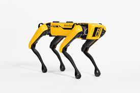

# Spot ROS2 Driver
This is a ROS 2 implemantion of the [ROS1 driver](https://github.com/clearpathrobotics/spot_ros) from Clearpath.
All ROS services are ported, but only the services: claim, power_on, stand and sit were tested.
The `/cmd_vel` topic also works and you can send commands to the spot via e.g. rqt_publisher.
This project is still WIP.

## Issues
The ros actions have not yet been ported. The RobotModel is not visible in rviz so far.
DepthCloud is not visible in rviz2 either, because DepthCloud has not been ported for rviz2 yet.
The `spot_viz` package is also missing.

## Prerequisites
    - Tested for ubuntu 20.04
    - ROS 2 foxy

## Install
    pip3 install bosdyn-client bosdyn-mission bosdyn-api bosdyn-core
    sudo apt install ros-foxy-joint-state-publisher-gui
    cd path/to/ros2/ws
    git clone https://github.com/MASKOR/Spot-ROS2.git src/
    colcon build --symlink-install

### Install depth image proc
Since `DepthCloud` is not yet ported for rviz2 , we can use [depth_image_proc](http://wiki.ros.org/depth_image_proc) to visualize the depth information from the cameras as `Pointcloud2`.

    sudo apt install ros-foxy-depth-image-proc

## Launch
The spot login data hostname, username and password must be specified in the `config/spot_login.yaml` of the spot_driver package.

### Model
    ros2 launch spot_description description.launch.py

### SpotDriver
    ros2 launch spot_driver spot_driver.launch.py

### Depth image to Pointcloud2
    ros2 launch spot_driver point_cloud_xyz.launch.py