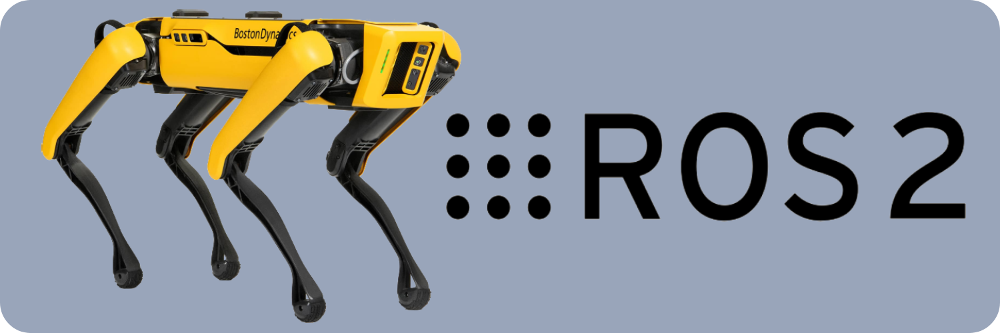

<p align="center">
  
  <h1 align="center">Spot ROS2 Driver</h1>
  <p align="center">
    <a href="https://github.com/MASKOR/spot_ros2/blob/main/LICENSE">
    
    </a>
    <a href="https://www.python.org/">
    
    </a>
    <a href="https://github.com/bdaiinstitute/spot_ros2/actions">
    
    </a>
    <a href="https://bdaiinstitute.github.io/spot_ros2">
    
    </a>
  </p>
</p>

# Overview
This is a ROS2 package for BostonDynamics' Spot. The package contains all necessary topics, services and actions to teleoperate or navigate Spot.
This package is derived of this [ROS1 package](https://github.com/heuristicus/spot_ros). This package currently corresponds to version 3.2.0 of the [spot-sdk](https://github.com/boston-dynamics/spot-sdk/releases/tag/v3.2.0)

## Prerequisites
    - Tested for Ubuntu 20.04 + Foxy
    - Tested for Ubuntu 22.04 + Humble

## Install
In your ROS2 workspace `src` directory, clone the repo:
```bash
git clone https://github.com/bdaiinstitute/spot_ros2.git
```
and initialize and install the submodules
```bash
cd spot_ros2
git submodule init
git submodule update
```

Then run the install script. The install script takes the optional argument ```--arm64```; it otherwise defaults to an AMD64 install. Run the correct command based on your system 
```bash
cd <path to spot_ros2>
./install_spot_ros2.sh
or
./install_spot_ros2.sh --arm64
```
From here, set up the ROS2 workspace
```
cd <ros2 ws>
source /opt/ros/humble/setup.bash
colcon build --symlink-install
source install/local_setup.bash
```

## Example Code
See the [examples](examples/) for some examples of using the ROS2 driver.

## Launch
The spot login data hostname, username and password can either be specified as ROS parameters or as environment variables.  If using ROS parameters, see `spot_driver/config/spot_ros_example.yaml` for an example of what your file could look like.  If using environment variables, define `BOSDYN_CLIENT_USERNAME`, `BOSDYN_CLIENT_PASSWORD`, and `SPOT_IP`.

### Model
    ros2 launch spot_description description.launch.py

### SpotDriver
    ros2 launch spot_driver spot_driver.launch.py [config_file:=<path to your ROS config file>] [has_arm:=<True|False>]

### Depth image to Pointcloud2
    ros2 launch spot_driver point_cloud_xyz.launch.py

### Command Line Example Node
The `command_spot_driver` node contains service and action clients. To send a trajectory goal execute:

    ros2 run spot_driver command_spot --ros-args -p command:=trajectory


### Multiple Robots
If you want to use multiple robots, use the `spot_driver_with_namespace` launch file:

    ros2 launch spot_driver_with_namespace.py spot_name:=<spot name> config_file:=<path to your ROS config file>

This will launch all nodes in the `spot_name` namespace and use `spot_name/` as the prefix for all frames.

## Advanced Install

### Install spot_msgs as a deb package
`spot_msgs` are normally compiled as part of this repository.  If you would prefer to install them as a debian package, follow the steps below:
```bash
wget -q -O /tmp/ros-humble-spot-msgs_0.0.0-0jammy_amd64.deb https://github.com/bdaiinstitute/spot_ros2/releases/download/spot_msgs-v0.0-0/ros-humble-spot-msgs_0.0.0-0jammy_amd64.deb
sudo dpkg -i /tmp/ros-humble-spot-msgs_0.0.0-0jammy_amd64.deb
rm /tmp/ros-humble-spot-msgs_0.0.0-0jammy_amd64.deb
```

### Install bosdyn_msgs from source
The `bosdyn_msgs` package is installed as a debian package as part of the `install_spot_ros2` script because it's very large.  It can be checked out from source [here](https://github.com/bdaiinstitute/bosdyn_msgs) and then built as a normal ROS2 package if that is preferred (compilation takes about 15 minutes).


## License

MIT license - parts of the code developed specifically for ROS2.
BSD3 license - parts of the code derived from the Clearpath Robotics ROS1 driver.

## Contributing
To contribute, install `pre-commit` via pip, run `pre-commit install` and then run `pre-commit run --all-files` to 
verify that your code will pass inspection. 
```bash
git clone https://github.com/bdaiinstitute/spot_ros2.git
cd spot_ros2
pip3 install pre-commit
pre-commit install
pre-commit run --all-files
```

Now whenever you commit code to this repository, it will be checked against our `pre-commit` hooks. You can also run
`git commit --no-verify` if you wish you commit without checking against the hooks. 

### Contributors

This project is a collaboration between the [Mobile Autonomous Systems & Cognitive Robotics Institute](https://maskor.fh-aachen.de/en/) (MASKOR) at [FH Aachen](https://www.fh-aachen.de/en/) and the [Boston Dynamics AI Institute](https://theaiinstitute.com/).

MASKOR contributors:

* Maximillian Kirsch
* Shubham Pawar
* Christoph Gollok
* Stefan Schiffer
* Alexander Ferrein

Boston Dynamics AI Institute contributors:

* Jenny Barry
* Daniel Gonzalez
* Tao Pang
* David Surovik
* Jiuguang Wang
* David Watkins

[Linköping University](https://liu.se/en/organisation/liu/ida) contributors:

* Tommy Persson
