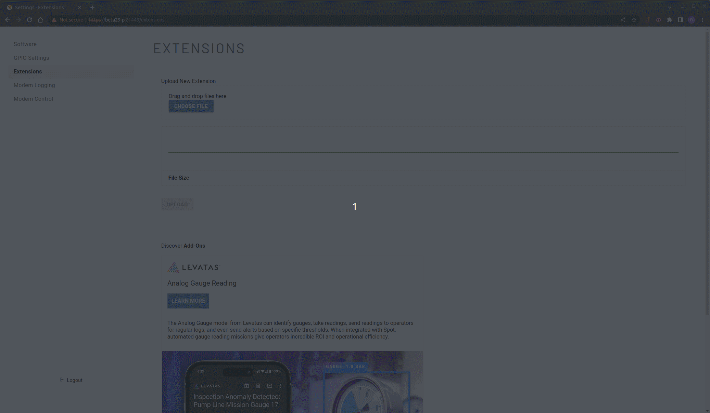

# Spot ROS 2 Extension for CORE I/O

[Extensions](https://dev.bostondynamics.com/docs/payload/docker_containers) are software packages or static files introduced in 3.2 that can be installed or simply uploaded to Boston Dynamics CORE I/O or Scout platforms.

This is an Extension that runs the [Spot ROS 2 Driver](https://github.com/bdaiinstitute/spot_ros2) on a Core I/O. Once the Extension is running additional ROS Nodes can be run from another machine connected to the robot's WiFi to send `RobotCommands` and visualize robot data.

The benefits of running the Spot ROS 2 Driver as an Extension on the CORE I/O are:

- Run ROS on the robot.
- ROS Spot Driver will continue to run even after comms lost with personal computer.
- Offload computation from your machine to the CORE I/O.

## Before Starting

Please read [CORE I/O Documentation](https://dev.bostondynamics.com/docs/payload/coreio_documentation) and [Running Custom Applications with Spot](https://dev.bostondynamics.com/docs/payload/docker_containers) before continuing.

## Requirements

- CORE I/O
- Personal computer running Ubuntu 22.04 and ROS Humble
- Configure the robot's WiFi to Access Point Mode
- Personal computer connected to the robot via Direct WiFi

# Spot Extension

An Extension is a set of docker images configured with a docker-compose yaml configuration file. Extensions are structured as a tgz file with a .spx file extension and contain the following files:

- `manifest.json`
- `icon.png`
- `docker-compose.yml`
- `spot_ros_param.yml` which you can modify with custom ROS params
- `Dockerfile.arm64` file that contains all the instructions to create a docker image with ROS 2 Humble and its dependencies.

This directory contains all the files required to build a docker image and create an Extension. However, you may need to make changes to the `docker-compose.yml` to set your robot's information.

## docker-compose.yml

The docker-compose file does not require modification, unless you have changed the robot's default network IPs.

```
version: "3.5"
services:
  ros_fastdds_discovery_server:
    image: spot_ros2:arm64
    network_mode: host
    ipc: host
    restart: unless-stopped
    # Launch the FastDDS discovery sever to bypass the need of multicast to discover nodes
    command: fastdds discovery -i 0 -p 21000
  spot_ros2:
    image: spot_ros2:arm64
    network_mode: host
    ipc: host
    restart: unless-stopped
    volumes:
      # Mount payload credentials.
      - /opt/payload_credentials/payload_guid_and_secret:/opt/payload_credentials/payload_guid_and_secret
    environment:
      - SPOT_IP=192.168.50.3   
      - ROS_DOMAIN_ID=56       
      - ROS_DISCOVERY_SERVER=192.168.80.3:21000   
      - PAYLOAD_CREDENTIALS=/opt/payload_credentials/payload_guid_and_secret
    # Launch the Spot ROS 2 driver 
    command: ros2 launch spot_driver spot_driver.launch.py config_file:=/spot_ros_params.yml
    depends_on:
      - ros_fastdds_discovery_server
```

The Extension will launch two containers. One to run the [Fast DDS Discovery Server](https://docs.ros.org/en/humble/Tutorials/Advanced/Discovery-Server/Discovery-Server.html) and a second one to run the [Spot Driver](https://github.com/bdaiinstitute/spot_ros2). Both containers are based on the same `spot_ros2:arm64` image and set the `network_mode` and `ipc` to host. Using the host mode will map the CORE I/O's host networking to the containers and simplify setup.

#### Discovery Server

ROS 2 presents some challenges operating in a distributed manner across multiple networks due to the fact that node discovery requires multicast packets, and node-to-node communication can occur on a wide range of ports. The CORE I/O uses firewall rules that control the ports on which incoming traffic is allowed. Thus, it is necessary to route all ROS traffic through the [range of allowed ports](https://dev.bostondynamics.com/docs/payload/docker_containers#ports-for-incoming-traffic) [21000 - 22000].

[Fast DDS Discovery Server](https://docs.ros.org/en/humble/Tutorials/Advanced/Discovery-Server/Discovery-Server.html) discovery protocol offers a centralized dynamic discovery mechanism, as opposed to the distributed mechanism used in DDS by default. This protocol allows routing communication through specific ports and does not use multicasting. The instruction

```
command: fastdds discovery -i 0 -p 21000
```

will launch a Discovery Server with `id 0`,`port 21000`, and listens on all available interfaces. The UDP port has to be within the allowable CORE I/O range [21000 - 22000] and has to match the port in the `ROS_DISCOVERY_SERVER` environment variable, we have set it to 21000. All nodes can use the discovery server to find other nodes. 

#### Spot Driver

The instruction

```
command: ros2 launch spot_driver spot_driver.launch.py config_file:=/spot_ros_params.yml`
```

will launch the Spot Driver using the ROS parameters set in `spot_ros_params.yml`. Make sure to edit any of the parameters in this yaml before you create the extension. The yaml file is copied to the docker image when it is built, so changes after the fact will not be reflected in the Extension. This container also depends on `ros_fastdds_discovery_server` to ensure the Spot Driver is launched after the discovery server.

##### Authentication 
Instead of using user credentials that require setting the environment variables `BOSDYN_CLIENT_USERNAME` and `BOSDYN_CLIENT_PASSWORD` the extensions authenticates the robot instance from the payload credentials. 

##### Environment Variables 
- `SPOT_IP` : The IP address of the robot on the local payload port network.
- `ROS_DOMAIN_ID` : The domain ID is used by DDS to compute the UDP ports that will be used for discovery and communication, set to `56` to be in the CORE I/O port range.
- `ROS_DISCOVERY_SERVER` : Location of the discovery server.
- `PAYLOAD_CREDENTIALS` : Path inside the container where the payload credentials where mounted to. 

## Build The Extension

This directory contains a script create_extension.sh that can be used to create an l4t-based Spot Extension for this example. This will create a file spot_detect_and_follow.spx, which can be uploaded to the CORE I/O. The extension requires that the payload be authorized on the robot admin console to run.

If building on a host system architecture that is not `ARM64` based run the following before continuing.

```sh
sudo apt-get install qemu binfmt-support qemu-user-static
```

Installing and running qemu will allow to build ARM binaries on an x86 machine without needing a cross compiler, see [Build Docker Images Documentations](https://dev.bostondynamics.com/docs/payload/docker_containers#build-docker-images) for more details.

This directory contains a script `create_extension.sh` that can be used to build a `ARM64` docker image and package all the files into an Extension. From the `ros2_driver` directory run the script

```sh
./create_extension.sh
```

This will create the `spot_ros2_driver.spx` extension file that you can upload to the CORE I/O or Scout platform. The script was tested on Ubuntu 22.04 with x86 architecture.

## Install and Run the Extension

Before you install and run the `spot_ros2_driver.spx` you need to configure the port range used by a connection in the CORE I/O to be within the allowable port range.

### Limit the ports used by a connection in the CORE I/O

SSH into the CORE I/O from the robot’s WiFi

```sh
ssh -p 20022 spot@192.168.80.3
```

Make a copy of the default port ranges

```
cat /proc/sys/net/ipv4/ip_local_port_range > /proc/sys/net/ipv4/ip_local_port_range.bak
```

Limit the ports a networking connection can use to those reachable through the CORE I/O's firewall

```
echo "21000 22000" | sudo tee /proc/sys/net/ipv4/ip_local_port_range
```

This will force all connections from the CORE I/O to be on the port range 21000 - 22000.

### Install Extension Using Web Portal

Extensions can be installed from the Extensions page by drag-and-dropping the `spot_ros2_driver.spx` Extension file onto the “Upload New Extension” subpanel, as shown in the video below:



Extensions can also be installed by clicking the “Choose File” button and selecting the Extension file manually in the File browser window that opens up. For more details and other methods of installing the extension see [Running Custom Applications with Spot](https://dev.bostondynamics.com/docs/payload/docker_containers#install-extension-using-web-portal).

Once installed it will automatically start the Extension. It should have started two containers; the first named `ros_fastdds_discovery_server` runs the [Fast DDS Discovery Server](https://docs.ros.org/en/humble/Tutorials/Advanced/Discovery-Server/Discovery-Server.html), the second named `spot_ros2` launches the [ROS 2 SpotDriver](https://github.com/bdaiinstitute/spot_ros2/tree/main/spot_driver).


See [Monitoring](https://dev.bostondynamics.com/docs/payload/docker_containers#monitoring) for details on how to monitor the status of the Extension.

## Set up your machine for communication with the CORE I/O

Follow the steps below to enable a connection between a ROS node running on a remote machine connected to the [robot's WiFi](https://support.bostondynamics.com/s/article/Spot-network-setup) and the ROS Spot Driver on the CORE I/O.

### Add static IP route to the CORE I/O

Configure your remote machine to direct packets to the CORE I/O IP (`192.168.50.5`) through the robot's IP (`192.168.80.3`) by adding a static route.

```sh
sudo ip route add 192.168.50.5 via 192.168.80.3
```

Make sure you can ping the CORE I/O from your machine.

```sh
ping 192.168.50.5
```

### Export ROS Discovery Server

Set the `ROS_DISCOVERY_SERVER` environment variable to specify which server to connect to. **NOTE** that the IP and port must match that defined in the Dockerfile and you need to set this variable on every new terminal.

```sh
export ROS_DISCOVERY_SERVER=192.168.80.3:21000
```

### Open firewall ports for DDS Traffic

If you have a firewall in your machine, you will probably need to open some firewall ports. Assuming you run the Discovery Server with domain=0 (the default), then you need to allow traffic through ports,

- DiscoveryUnicastPort = 7412
- UserUnicastPost =7413

To allow traffic on these ports using uwf, enter:

```
sudo ufw allow 7412 && sudo uff allow 7413
```

For details see [Statically configure a Firewall to let OMG DDS Traffic through](https://community.rti.com/howto/statically-configure-firewall-let-omg-dds-traffic-through).

### Launch additional ROS 2 Nodes

Now that your machine is configured to communicate with the CORE I/O you can launch ROS 2 Nodes to visualize the robot's state and send `RobotCommands` to the Spot Driver.

### Run RViz

**NOTE**: Do not forget to source ROS 2 and set the environment variable `ROS_DISCOVERY_SERVER` to the location of the discovery server on every new terminal.

```sh
ros2 launch spot_description description.launch.py
```

RViz should launch on your machine and you should be able to visualize a model of Spot.

### Run the Simple Walk Forward Example

A simple example that shows how to use ROS2 to send RobotCommand goals to the spot driver.

**NOTE**: Do not forget to source ROS 2 and set the environment variable `ROS_DISCOVERY_SERVER` to the location of the discovery server on every new terminal.

```sh
ros2 run simple_walk_forward walk_forward
```

The robot should move its arm up and down.

### Run the Simple Arm Motion Example

An example of converting the BD BD Simple Arm Motion to use ROS2. You will need a Spot with an Arm for this example to work.

**NOTE**: Do not forget to source ROS 2 and set the environment variable `ROS_DISCOVERY_SERVER` to the location of the discovery server on every new terminal.

```sh
ros2 run simple_walk_forward walk_forward
```

The robot should walk forward.

## Run the Simple Walk Forward example as an Extension

You can also run additional ROS Nodes as an Extension. Because the `Dockerfile` builds [simple walk forward](https://github.com/bdaiinstitute/spot_ros2/tree/main/examples/simple_walk_forward) package we can use the same image and just create a new `docker-compose.yml` file that launches the simple walk forward example as follow.

```
version: "3.5"
services:
   walk_forward:
    image: spot_ros2:arm64
    network_mode: host
    ipc: host
    restart: unless-stopped
    # Launch the walk forward example
    command: ros2 run simple_walk_forward walk_forward
```

Then follow the steps above to create and install the Extension. Make sure to give this Extension a unique name (e.g. ros_walk_forward). Otherwise, it will uninstall the original `spot_ros2_driver` Extension when installing.

## Known Issues

### Building arm64 container

`spot_driver` depends on `bosdyn_msgs` and `spot_msgs`. These two packages are provided by BDAII as debian packages. However, they are only compatible with `x86_32` architecture not `arm64`. We can build both from source to target `arm64`, `Ubuntu 22.04`, and `ROS Humble`

The docker image `Dockerfile.msg` will create the required `bosdyn_msgs`, a copy of the debian package is found in this directory `ros-humble-bosdyn-msgs_0.0.0-0jammy_arm64.deb`. It follows these [steps](https://github.com/bdaiinstitute/bosdyn_msgs/tree/56c4d5f94142542f961be9e682c51c535ebe8886).

The `spot_msgs` package gets built from source using the ROS build system when building the docker image.

### FastDDS Discovery Server cannot list all topics and nodes

A limitation of the Discovery Server is that you cannot view all the ROS Node’s graph and topics and endpoint information. It limits discovery traffic, so not all topic discovery information is available on every node (like standard multicasting base DDS discovery). Some tools like `ROS CLI` will not work, and you won't be able to use commands like

```
ros2 topic list
```

it will return an empty list.

A solution is to configure nodes as Super Clients. This will allow the node to discover the entire Node graph, and to receive every topic and endoport information.
